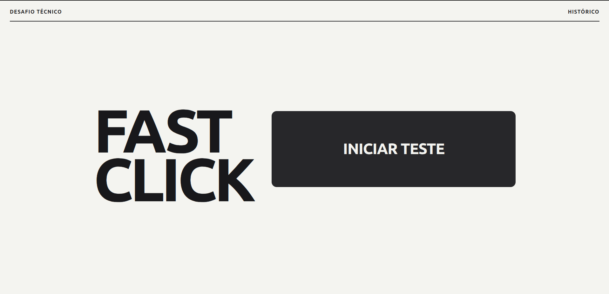
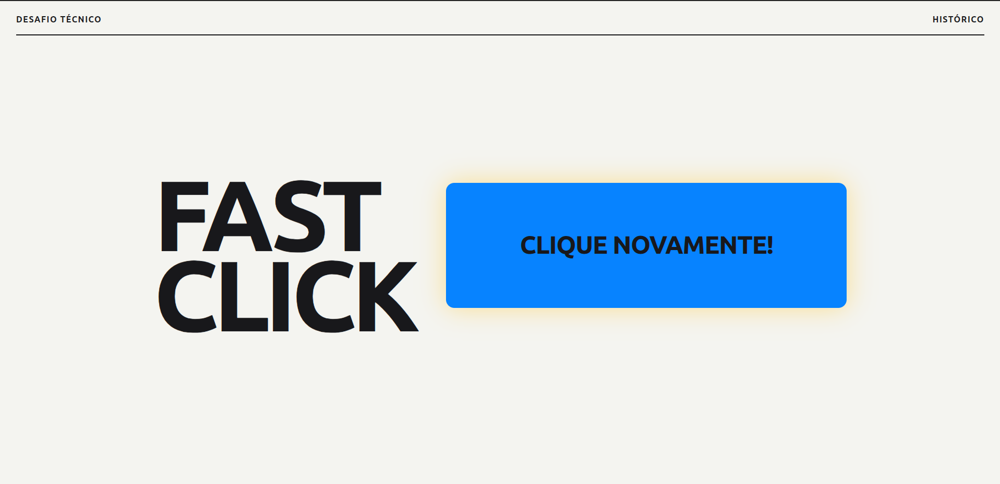
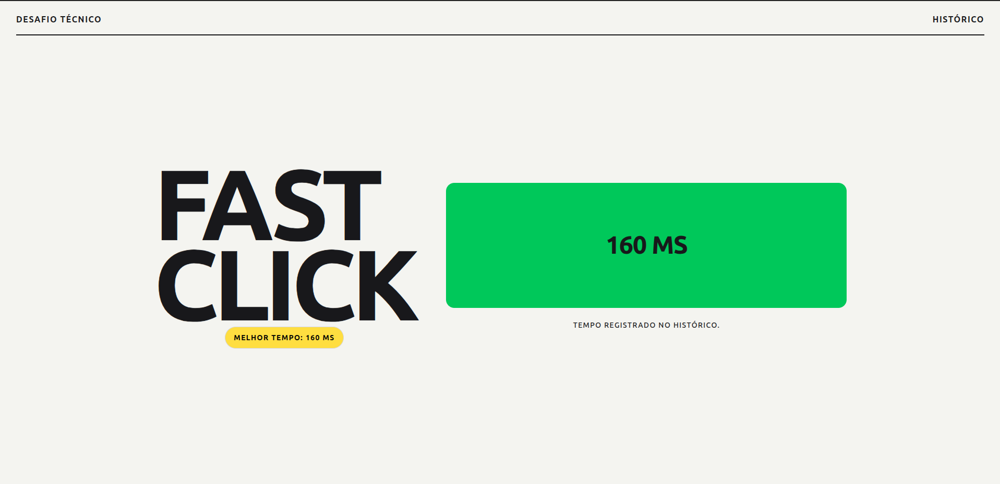
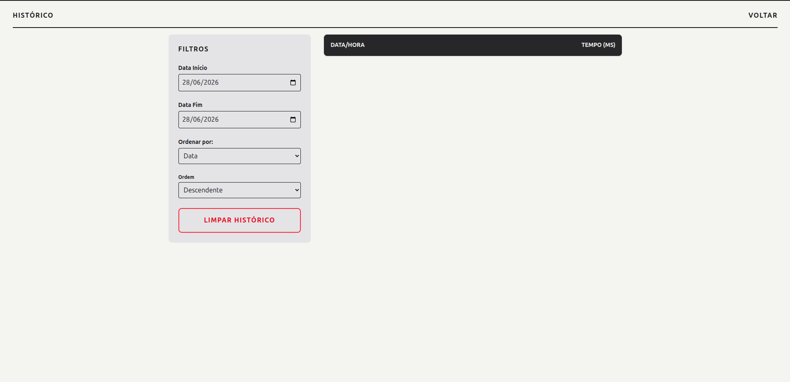
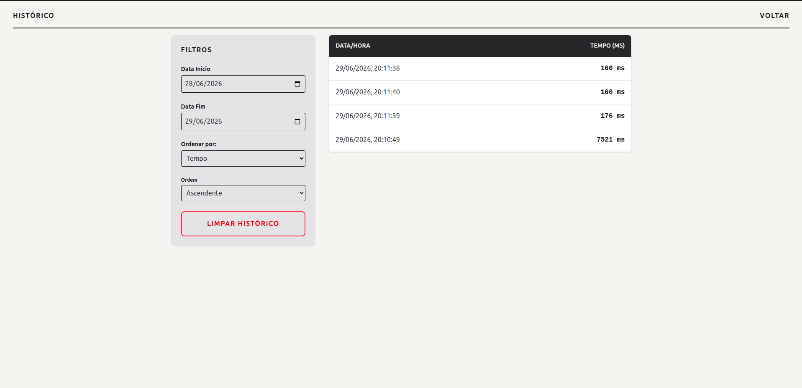

# Fast Double-Click ⏱

Aplicação full-stack desenvolvida como desafio técnico para medir e registrar o tempo de reação entre dois cliques consecutivos.

O projeto foca em uma interface minimalista e direta, com processamento de dados e regras de negócio isoladas no servidor, garantindo uma separação clara de responsabilidades entre o Front-end e o Back-end.

## Tecnologias Utilizadas

- **Front-end:** React.js (inicializado com Vite para maior performance) + Tailwind CSS v4 para estilização contida e utilitária.
- **Back-end:** Node.js com Express.js.
- **Persistência:** Manipulação assíncrona nativa (`fs.promises`) em arquivo `registros.json`, dispensando bancos de dados complexos para atender ao escopo de forma leve e eficiente.

## Decisões Arquiteturais

1.  **Filtros no Servidor:** Toda a lógica de ordenação (asc/desc) e filtragem por intervalo de datas foi implementada no Back-end via `req.query`. Isso evita o gargalo de processar arrays massivos no lado do cliente.
2.  **Identificadores Únicos:** Utilização de _Timestamps_ (`Date.now()`) como IDs no arquivo JSON.
3.  **Gestão de Recursos (Limpeza de Dados):** Implementação de uma rota `DELETE` para apagar o histórico e zerar o arquivo `registros.json`.
4.  **Reaproveitamento de Rotas (Recorde Atual):** O selo de "Melhor Tempo" exibido na tela inicial foi concebido sem a necessidade de criar novas lógicas no Back-end. Ele reaproveita a rota `GET` de listagem, aplicando os parâmetros de ordenação via URL (`?sortBy=time&order=asc`) e consumindo apenas o primeiro índice.

## Como Executar o Projeto

Necessário ter o [Node.js](https://nodejs.org/) instalado em sua máquina.

### 1. Clonando o repositório

Clone o projeto e acesse a pasta raiz:
\`\`\`bash
git clone https://github.com/SEU_USUARIO/fast-double-click.git
cd fast-double-click
\`\`\`

### 2. Rodando o Back-end (API)

Abra uma aba no seu terminal e execute:
\`\`\`bash
cd backend
npm install
node server.js
\`\`\`

> O servidor iniciará na porta **3000** e gerará o arquivo \`registros.json\` automaticamente no primeiro POST.

### 3. Rodando o Front-end (Interface)

Abra uma **nova aba** no terminal e execute:
\`\`\`bash
cd frontend
npm install
npm run dev
\`\`\`

> A aplicação estará disponível no endereço gerado pelo Vite (geralmente \`http://localhost:5173\`).

## Demonstração da Aplicação

### 1. Fluxo de Ação e Recordes

|                 1. Estado Inicial                 |                   2. Aguardando Clique                   |
| :-----------------------------------------------: | :------------------------------------------------------: |
|             |                 |
| A tela inicial limpa antes de qualquer interação. | O botão muda para amarelo indicando a contagem do tempo. |

|                            3. Primeiro Resultado                            |                         4. Quebra de Recorde                          |
| :-------------------------------------------------------------------------: | :-------------------------------------------------------------------: |
|                                    |                                   |
| Feedback de sucesso (verde) e estabelecimento do primeiro recorde absoluto. | Um novo clique mais rápido substitui dinamicamente o topo do ranking. |

---

### 2. Gestão de Histórico e Filtros

|                                           Visão Geral do Histórico                                            |
| :-----------------------------------------------------------------------------------------------------------: |
|                                                                     |
| _Exibição em grid de 5 colunas com a listagem completa (sem filtros) e botão de limpeza isolado visualmente._ |

|                           Filtro de Data (Empty State)                            |                                  Filtro de Ordenação (Ascendente)                                  |
| :-------------------------------------------------------------------------------: | :------------------------------------------------------------------------------------------------: |
|                                                |                                                            |
| A tabela reage quando um filtro de intervalo de datas exclui todos os resultados. | O back-end processa a ordenação dos dados via `req.query`, trazendo os menores tempos para o topo. |

## Autor

Desenvolvido por Marcos Vinícius.
